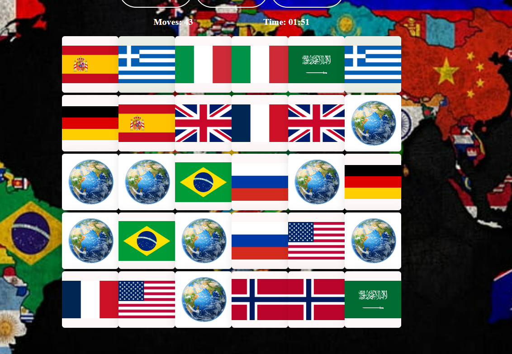

# Kal. Memory Game
This is a small sample of a memory game created using JavaScript, HTML, and CSS. This version serves as a basic demonstration of the game's functionality and design. The final version will incorporate Java Servlets, a database, and additional features, and will be hosted on a Tomcat web server.

# Features

- <b>Theme selection</b>: Choose from a limited set of themes in this sample, such as football teams,animals,great historic personalities and country flags.

- Difficulty Levels:Experience basic difficulty levels that challenge your memory skills.
Players can  select from different difficulty levels, ranging from easy to expert.

# Technologies Used (Sample)
- Frontend:HTML,CSS,Javascript

# Setup Instructions (Sample)
Clone this repository to your local machine.
Open the index.html file in your web browser to play the sample game.

# Development Roadmap (Sample)

his sample version provides a basic understanding of the game mechanics and design. The final version, hosted on a Tomcat web server, will include :

- Backend Integration: Implement Java Servlets for enhanced functionality, including a user authentication system.

- Database: Create and configure the database for storing high scores, user data, and game statistics. The system will include user account management, sign-in, and log-out features.

The final version of the game will not only challenge your memory but also provide a comprehensive gaming experience with a rich array of animations that respond to your performance. The speed and precision of your guesses, as well as the number of consecutive correct or wrong answers, will influence the visual effects and transitions throughout the game!

  

